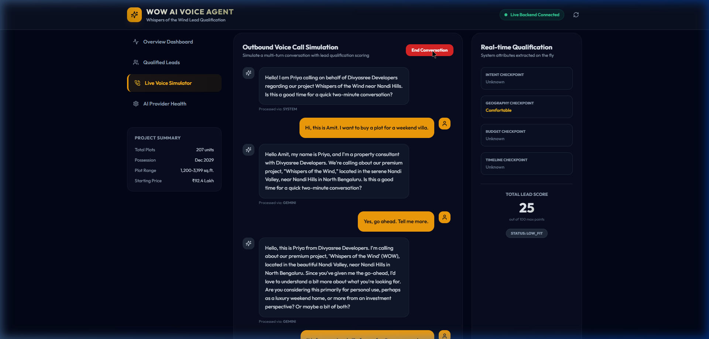

# 🍃 Whispers of the Wind (WOW) — AI Voice Lead Qualification System

> **A production-grade, voice-AI lead qualification system for Divyasree Developers' premium villa plot development in Nandi Valley, North Bengaluru.**

---

## 📸 Dashboard & Simulator Preview

Here is a look at the live outbound call simulation dashboard, displaying lead metrics, real-time qualification scores, and AI provider selection feedback:



---

## 🚀 Key Features

* **Unified AI Orchestration**: Priority failover chain using `Gemini 2.5 Flash ➔ Grok 3 Mini ➔ Ollama (Local) ➔ Demo mode`.
* **Automatic Cooldown Management**: Auto-cools failed providers for 300 seconds to prevent resource locks and maximize API reliability.
* **4-Checkpoint Qualification Model**: Qualifies leads based on **Intent** (self-use/investment), **Geography** (comfort with Nandi Hills), **Budget** (fitment for ₹92.4L+), and **Timeline** (December 2029 possession).
* **Automatic Bilingual Handling**: Smoothly switches between English and Hinglish/Hindi based on user audio inputs.
* **Modern Tech Stack**: Fastify API (TypeScript, MongoDB Atlas) + React Frontend (Vite, Tailwind CSS, Lucide icons).

---

## 🛠️ Folder Structure

```
wow-ai-voice-agent/
├── backend/            # Fastify backend, prompt definitions, and AI Provider manager
├── frontend/           # Vite + React dashboard and interactive chat simulator
├── docs/               # Architecture diagrams, API specs, research logs, and deployment guides
└── .agent-state/       # State verification checklists and design decisions
```

---

## ⚙️ Running Locally

### 1. Prerequisites
* Node.js (v24.13.0 or higher)
* MongoDB (running locally or a cloud Atlas connection string)
* Gemini API Key

### 2. Setup Environment Variables
Create a `.env` file in the root directory (based on `.env.example`):
```ini
PORT=5000
MONGODB_URI=mongodb://localhost:27017/wowai
GEMINI_API_KEY=your_gemini_api_key
```

### 3. Install & Start
Run the following commands in the project root:
```bash
# Install dependencies
npm install

# Run backend and frontend concurrently
npm run dev
```
The frontend will start at `http://localhost:5173/` and the backend on port `5000`.

---

## 🌐 Production Deployment

### Backend (Render)
Deploy the backend web service by targeting the `backend/` subdirectory with start command `node dist/server.js`. Provide the environment variables securely on the Render dashboard.

### Frontend (Netlify / Vercel)
Build the React bundle inside `frontend/` using `npm run build` and host the generated `dist` folder. Update `VITE_API_URL` to point to your live backend endpoint.

---

## 📝 License
This project is licensed under the MIT License.
