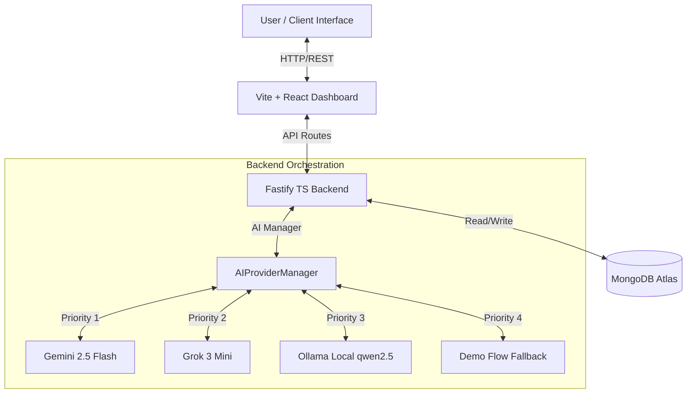

# SYSTEM ARCHITECTURE — WOW Voice AI Agent

This document details the multi-layered architecture of the Whispers of the Wind AI Lead Qualification System.

## Architectural Overview

## Core Layers

### 1. Unified AI Provider Manager (Failover Engine)
* **Status Monitoring**: Tracks the availability of each model. If a provider returns an authentication error (e.g., 403) or rate limit (429), it's put on a cooldown timer (300s).
* **Exponential Backoff**: Transient connection issues trigger retries with exponential delay before failing over to the next candidate in the chain.
* **Redundancy Priority**: `Gemini` ➔ `Grok` ➔ `Ollama` ➔ `Demo`.

### 2. Conversational Lead Qualification Engine
* Enforces the 4-Checkpoint Model (Intent, Geography, Budget, Timeline).
* Extracts lead profile parameters on the fly during natural conversations.
* Assigns points to each checkpoint (max 100) and scores status (HOT, WARM, NURTURE, LOW_FIT).

### 3. Database Layer (MongoDB)
* **Leads**: Stored qualified profiles, objections, and final scores.
* **Conversations**: Stores historical dialogue context, system instructions, and token usage for audits.
* **Callbacks**: Tracks scheduled callbacks requested by interested buyers.
